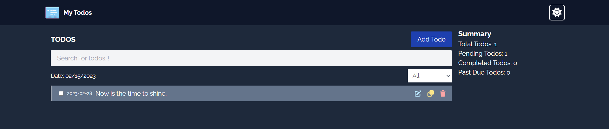

# todo
Todo Web App using VueJs & Vuex for state management. 

<p align="center">
    
</p>


### Techs/Libraries/Packages used,
| Techs/Libraries/Packages | Description        |
|--------------------------|--------------------|
| Vue                      | JS Framework       | 
| Vuex                     | State Management   |
| Vee Validate + Yup       | Form Validation    |
| Font Awesome Icons       | Icons              |
| TailwindCSS              | Theming & Styling  |
| Local Storage            | Persistent Storage |
| Jest                     | Testing            |

Check out the live deployed preview of the app.
- [Live Link](https://mytodosdone.netlify.app)

## Project setup
Clone the repository and install all dependencies
```
yarn install
```

### Compiles and hot-reloads for development
```
yarn serve
```

### Compiles and minifies for production
```
yarn build
```

### Lints and fixes files
```
yarn lint
```

### Tests 
For testing we're using jest.
```
yarn jest
```